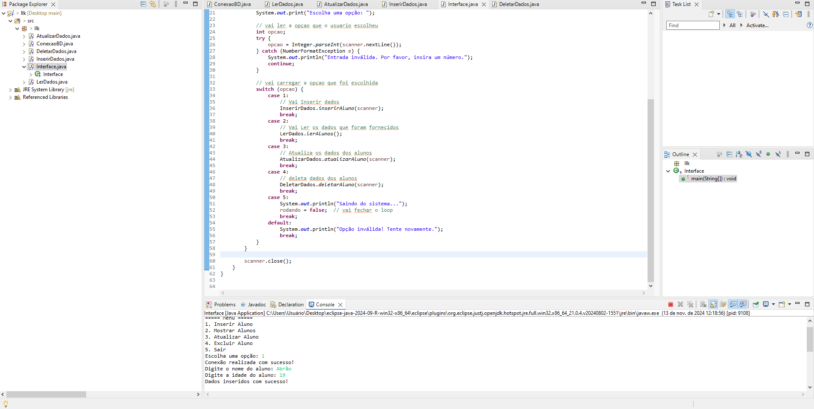
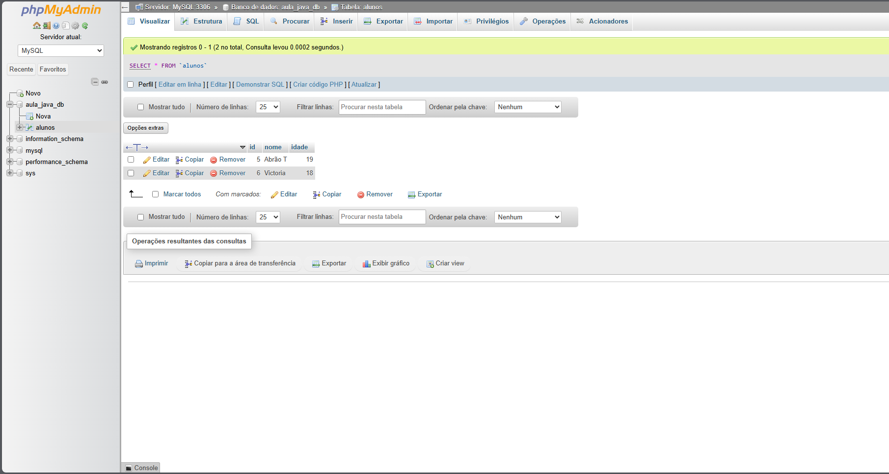
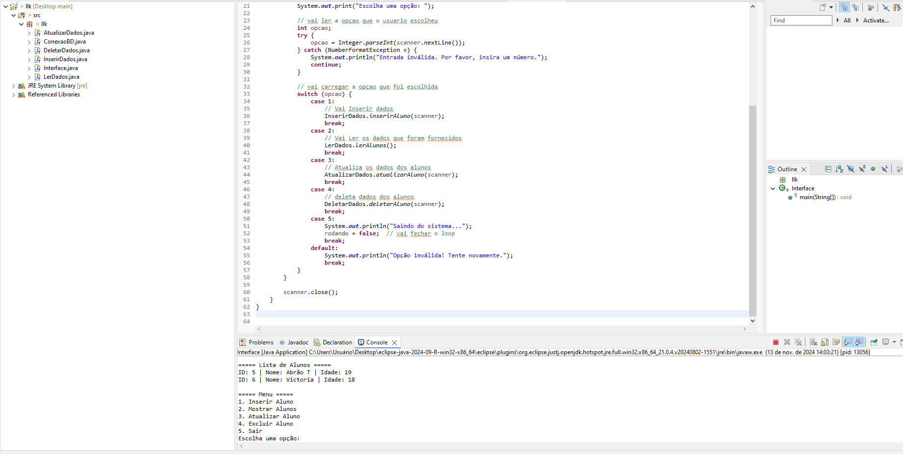
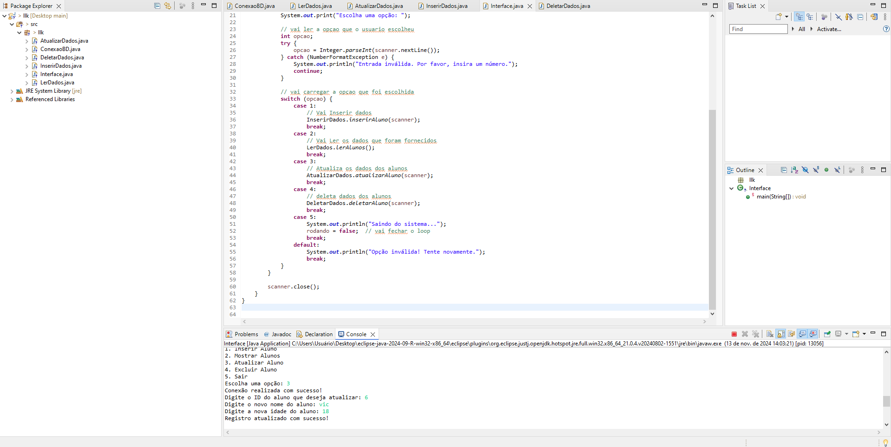
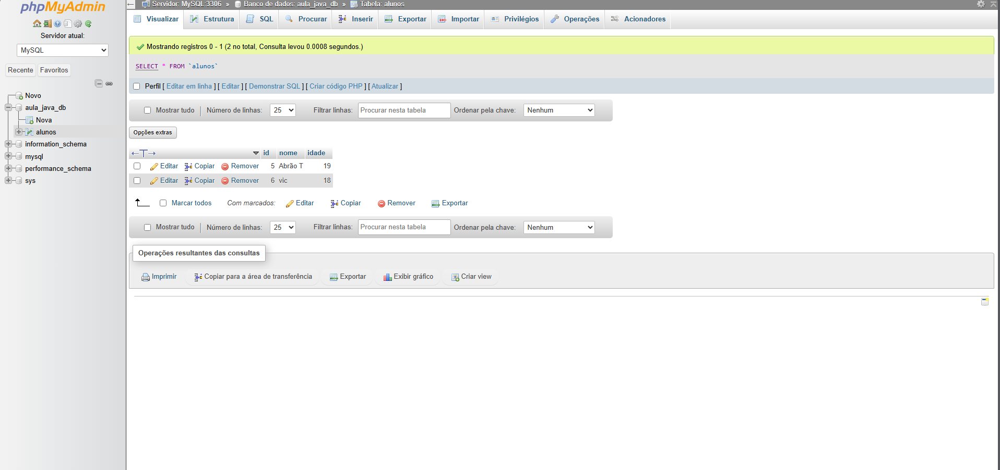
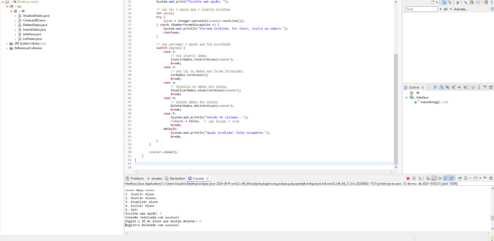
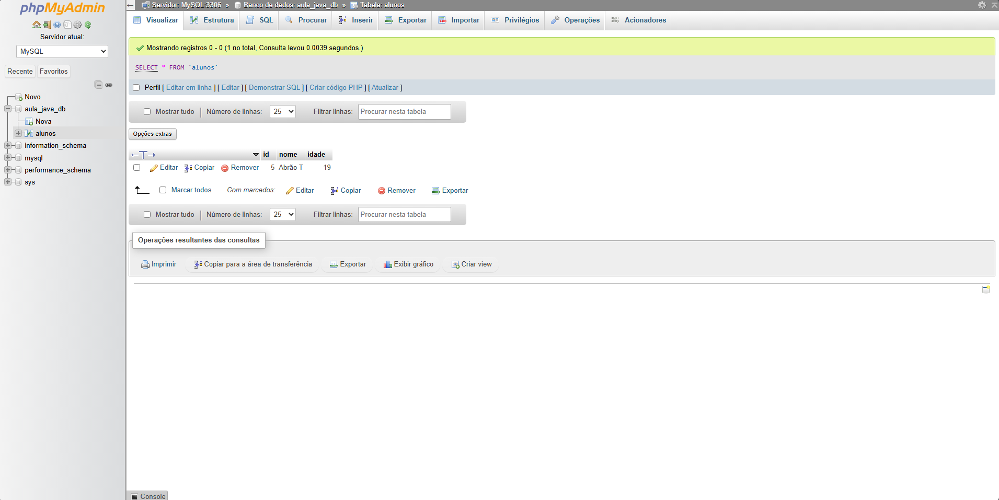
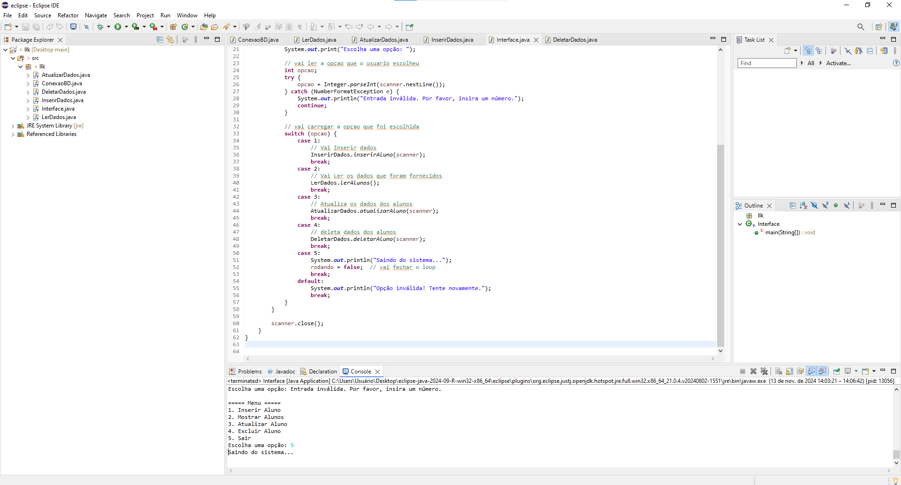

# Lista de Exercícios - Atividade individual - JDBC

Projeto da matéria de POO FACENS

## 🚀 Começando

## ETAPA 1

* CRIE UM PROJETO EM JAVA E REPRODUZA O EXEMPLO DO SOBRE O TEMA DA AULA DE JDBC;

* NO EXEMPLO, SERÁ NECESSÁRIO UTILIZAR O WAMP PARA ACESSO DO BANCO DE DADOS MYSQL, CONFIRA INFORMAÇÕES NO CONTEÚDO DA AULA 11 - WAMP;

* APÓS A CONFIGURAÇÃO DO AMBIENTE, CRIE AMBAS AS CLASSES DE CONEXÃO E INSERÇÃO DE DADOS;

* AO TÉRMINO CRIE UM REPOSITÓRIO REMOTO COM NOME CONEXAOBD;

## ETAPA 2

* APÓS O TÉRMINO DA PRIMEIRA ETAPA CRIE AS SEGUINTES CLASSE:

* ATUALIZARDADOS; DELETARDADOS; LERDADOS.

* CADA CLASSE TEM UMA FUNÇÃO PARA O PROJETO;

* TESTE O PROJETO E SEU FUNCIONAMENTO;

* TESTE O FUNCIONAMENTO DE CADA CLASSE CRIADA, PARA ISSO COMPILE A CLASSE E CONFIRA NO CONSOLE E NO PHPMYADMIN;

* A CADA MODIFICAÇÃO NO BANCO TIRE UM PRINT DA TELA E INSIRA NO README.MD;

* POR FIM, CRIE UMA INTERFACE NO ESTILO INTERFACE COMMAND-LINE PARA O SEU PROJETO, A INTERFACE DEVE SEGUIR ESTE PADRÃO:

## 🛠️ Construído com

* Eclipse 

## 📌 Versão

* **Versão 1.0** 

## ✒️ Autores

* **Abrão Alves Trevizan** - *Atividade individual - JDBC* 